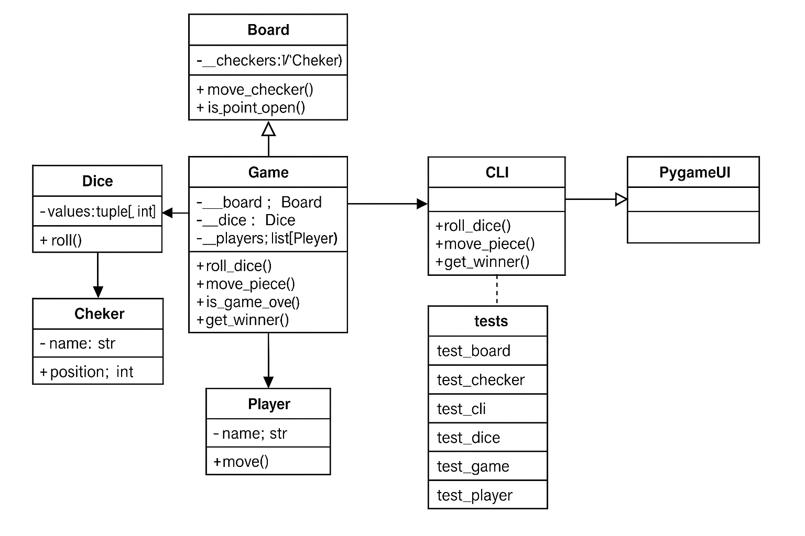

# JUSTIFICACION.md - Proyecto Backgammon

## 1. Resumen del Diseño General

El proyecto está diseñado siguiendo una arquitectura de **separación de capas (Separation of Concerns)**. El objetivo principal fue aislar completamente la lógica de negocio del juego de cualquier interfaz de usuario.

Esto se logró creando un paquete `core` que contiene toda la lógica y las reglas del Backgammon. Las interfaces de usuario, `cli.py` (Interfaz de Línea de Comandos) y `pygame_ui.py` (Interfaz Gráfica), actúan como "clientes" de este paquete `core`.

* **Paquete `core`**: Es el cerebro del proyecto. No sabe si los datos se están mostrando en una consola o en una ventana gráfica. Contiene las clases `Game`, `Board`, `Player` y `Dice`.
* **Capas de Presentación (`cli.py`, `pygame_ui.py`)**: Estas capas importan `core.game` para funcionar. Se encargan de:
    1.  Recibir la entrada del usuario (clics del ratón o comandos de texto).
    2.  Llamar a los métodos correspondientes del objeto `Game` (ej. `game.move_piece()`, `game.roll_dice()`).
    3.  Recibir el estado actualizado del juego desde `core` y "dibujarlo" en la pantalla o consola.

Esta separación es una implementación directa del principio **SOLID de Inversión de Dependencias (D)**, donde las capas de alto nivel (UI) dependen de las abstracciones de bajo nivel (lógica `core`), y no al revés.

Aquí se puede ver un ejemplo de la capa de presentación (`pygame_ui.py`) consumiendo la lógica de `core`:

---

## 2. Justificación de Clases (Principio de Responsabilidad Única - S)

Cada clase en el paquete `core` fue diseñada con una responsabilidad única y bien definida:

* **`Game` (`game.py`)**: Es el **orquestador** o "motor" del juego. Su única responsabilidad es gestionar el flujo de la partida.
    * Mantiene la instancia del `Board`, los `Player` y los `Dice`.
    * Controla el estado del juego (quién es el `current_player`, si el juego ha terminado).
    * Valida las acciones de alto nivel (ej. "solo puedes mover si es tu turno", "no puedes terminar el turno si te quedan dados").

* **`Board` (`board.py`)**: Representa el **estado físico del tablero**. Su responsabilidad es saber dónde está cada ficha.
    * Gestiona la lista de 24 puntos (`self.__pos__`).
    * Administra las fichas capturadas en la barra (`self.__bar__`).
    * Lleva la cuenta de las fichas que han salido del tablero (`self.__off_board__`).
    * Proporciona métodos para mover fichas, capturar, y reingresar desde la barra. *No* sabe de turnos ni de dados, solo ejecuta las órdenes que recibe.

* **`Player` (`player.py`)**: Representa a un jugador.
    * Almacena datos simples como el nombre y el color.
    * **Decisión de Diseño:** La gestión de turnos (`current_turn`, `switch_turn`) se implementó con **métodos de clase (`@classmethod`)**. Se eligió este enfoque para que el "turno actual" sea un estado global y único de la clase `Player`, en lugar de ser una variable gestionada por el objeto `Game`. Esto simplifica la lógica, ya que cualquier parte del sistema puede consultar `Player.current_turn` para saber a quién le toca.

* **`Dice` (`dice.py`)**: Gestiona todo lo relacionado con los dados.
    * Tira los dados y maneja los dobles (`roll()`).
    * Mantiene una lista de los valores disponibles (`self.__values__`) y los que ya se usaron (`self.__used_values__`).
    * Esto es crucial para que la clase `Game` pueda validar movimientos (ej. "el jugador intentó mover 4 puntos, ¿hay un 4 disponible en los dados?").

* **`Checker` (`checker.py`)**: (Esta es una justificación importante)
    * **Decisión de Diseño:** Inicialmente se consideró que el `Board` tuviera una lista de 24 listas de objetos `Checker`. Sin embargo, se optó por un diseño más simple y eficiente.
    * En lugar de gestionar 30 objetos `Checker`, la clase `Board` usa una representación de datos simple: `self.__pos__` es una lista donde cada índice es `[color, cantidad_de_fichas]`.
    * Esto hace que los movimientos, las capturas y el conteo de fichas sean operaciones de listas mucho más rápidas y simples, reduciendo la complejidad del estado del juego. La clase `Checker` se mantiene (`checker.py`), pero no es la unidad fundamental de la lógica del tablero.

---

## 3. Manejo de Excepciones

Para comunicar errores desde la capa `core` a las capas de UI, se decidió usar **excepciones personalizadas** en lugar de simplemente retornar `False` o códigos de error. Esto permite a la UI saber *exactamente* qué salió mal y mostrar un mensaje claro al usuario.

Las excepciones definidas en `game.py` son:

* **`InvalidMoveError`**: Se lanza cuando un movimiento no es legal (ej. el dado no coincide, la casilla de destino está bloqueada).
* **`NotYourTurnError`**: Se lanza si un jugador intenta realizar una acción (mover, tirar dados) cuando no es su turno.
* **`NoPiecesInBarError`**: Se lanza si el jugador intenta mover una ficha del tablero normal cuando tiene fichas en la barra (`self.__bar__`).

---

## 4. Estrategia de Testing (Tests Unitarios)

Se utilizó el módulo `unittest` de Python para garantizar el correcto funcionamiento de la lógica de `core`. La estrategia fue:

1.  **Testear cada clase de forma aislada**:
    * `test_board.py`: Prueba la configuración inicial, los movimientos válidos e inválidos, las capturas y el reingreso.
    * `test_dice.py`: Prueba que la tirada de dados funcione, que los dobles se manejen (4 valores) y que los valores se "gasten" correctamente.
    * `test_player.py`: Prueba principalmente el sistema de turnos (`switch_turn`).
    * `test_game.py`: Prueba el flujo completo, como `start()`, `roll_dice()`, `move_piece()` y `end_turn()`, asegurándose de que las excepciones se lancen correctamente.

2.  **Uso de Mocks (`unittest.mock`)**:
    * En `test_dice.py` y `test_game.py`, se utiliza `@patch('random.randint')` (o `@patch('core.dice.get_dice')`). Esto es **fundamental** para crear tests predecibles. En lugar de que los dados saquen un número al azar, "mockeamos" la función `random.randint` para que devuelva valores conocidos (ej. `side_effect=[3, 4]`).
    * Esto nos permite probar escenarios específicos, como "¿qué pasa si el jugador saca un `[3, 4]`?" o "¿qué pasa si saca dobles `[6, 6]`?", sin dejar el resultado del test al azar.

El resultado de esta estrategia es una alta cobertura de código, como se evidencia en el reporte de `coverage`:

Reporte de Cobertura de Tests:

Name              Stmts   Miss  Cover
-------------------------------------
cli/cli.py          323     32    90%
core/board.py       227     11    95%
core/checker.py      22      2    91%
core/dice.py         43      2    95%
core/game.py        131     10    92%
core/player.py       52      7    87%
-------------------------------------
TOTAL               798     64    92%

## 5. Anexos

### Diagrama de Clases (UML)

